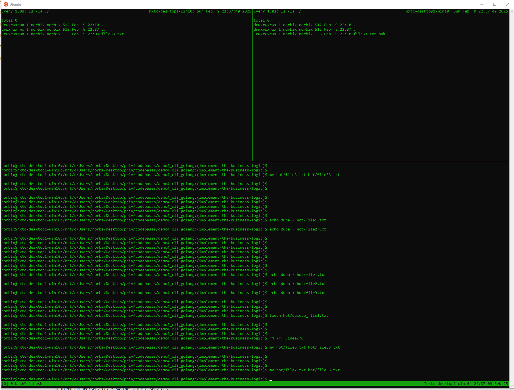

# demo4_cli_golang

Demo application containing a CLI solution in pure Golang and the application is a file filter CLI program for OS of your choice.

## Specification

### Overview

- Using systems programming language of your choice (Go / C / C++) write a file filter
  CLI program for OS of your choice. This filter should accept hot folder path and
  backup folder path, backing-up any file that is created or modified in the chosen
  folder.

### Requirements

- create a copy of any file created or modified in the hot folder
- backup files should have the same name of the original file with .bak extension
- if the file name is prefixed with 'delete_' it should be immediately deleted from
  the hot folder and backup folder
- keep a log file of all action taken by your program (file created, altered, backedup
  or deleted)
- log file can be viewed/filtered by you CLI app.
- log file filters should accept filter by [date, filename regex]
- the application must keep/save it's state between reboots

### Bonus

- if the file name is prefixed with 'delete_ISODATETIME_' it should be deleted at the
  specified time
- Use non-blocking IO

## Codebase structure (`hexagonal architecture`)

```text
./
├── LICENSE                 # Open-source license for the project
├── README.md               # Project documentation, setup, and usage instructions
├── Taskfile.yml            # Task automation file (for Windows/Linux/macOS)
├── Taskfile_windows.yml    # Task automation file (for Windows)
├── cmd                     # Entry point for the application (Application Layer)
|     ├── api
|       └── main.go         # Main entry point of the application, initializes dependencies
│   └── cmd.go              # CLI command definitions and execution logic
├── go.mod                  # Go module file (dependency management)
├── go.sum                  # Checksum of module dependencies
|── .env.dist               # Example environment variables configuration
└── internal                # Business logic and core application implementation
    ├── adapters            # Secondary (driven) adapters (Infrastructure Layer)
    │        └── cli
    │            └── cli_commands.go  # CLI commands implementation (user interaction)
    └── core                # Core application logic (Domain Layer)
        └── service
            ├── file_monitor.go      # File monitoring service (watching file system events)
            ├── file_monitor_test.go # Unit tests for file monitoring service
            └── log_service.go       # Service handling log management and filtering
```

## Setup

### Prerequisites

- Go SDK 1.23 or higher from [https://golang.org/dl/](https://golang.org/dl/)
- `Taskfile` from [https://taskfile.dev](https://taskfile.dev)

### Installation

1. Clone the repository:

    ```text
    git clone
    ```
   
1. Install dependencies:

    ```text
    go mod download
    ```
   
1. Run the application `dynamic mode`:

    - Menu driven CLI application

    ```text
    go run cmd\api\main.go    
    ```
   
    Example output:

    ```text
    CLI tool to monitor and backup files
    
    Usage:
    file-filter-cli [command]
    
    Available Commands:
    completion  Generate the autocompletion script for the specified shell
    help        Help about any command
    logs        View logs
    logs-filter Filter logs by date or filename
    monitor     Start monitoring the hot folder
    
    Flags:
    -h, --help   help for file-filter-cli
    
    Use "file-filter-cli [command] --help" for more information about a command.
    ```

    - `monitor` command to start monitoring the hot folder

    ```bash
    go run cmd\api\main.go monitor
    ```
   
    - `logs` command to view logs

    ```bash
    # help
    go run cmd\api\main.go logs --help

    # logs
    go run cmd\api\main.go logs
    
    # logs with custom application log file
    go run main.go logs --file custom_log.out
    ```

    - `logs-filter` command to filter logs by date or filename

    ```bash
    # help
    go run cmd\api\main.go logs-filter --help
   
    # logs-filter
    go run cmd\api\main.go logs-filter
   
    # logs-filter with custom application log file
    go run cmd\api\main.go logs-filter --file custom_log.out
   
    # logs-filter with custom application log file and filter by date
    go run cmd/api/main.go logs-filter "2025-02-09"
    go run cmd/api/main.go logs-filter "2025-02-09 21:11"
    
    # logs-filter log file and filter by severity level
    go run main.go logs-filter "ERROR" --file custom_log.out
    ```

## Manual E2E Test

1. Run the application:

    ```text
    task run
    ```
   
1. Open a new terminal and run the following command on `WSL` Linux terminal:

  - Create a ingestion `./hot` and egestion `./backup` folders.

    ```text
    mkdir ./hot
    mkdir ./backup   
    ```

  - Within `WSL` Linux open both `./hot` and `./backup` folders to track the changes. 
 
    ```text
    # Use tmux to split the terminal
    tmux
    
    # Split the terminal vertically
      Ctrl+b %
    
    # Split the terminal horizontally
      Ctrl+b "
  
    # Track the changes in the hot folder
    watch -n 1 ls -ls ./hot
    
    # Track the changes in the backup folder
    watch -n 1 ls -ls ./backup
    
    # Track the changes in the log file
    tail -f ./demo4_cli_golang.out
    
    # Track changes in the serialized state file
    watch -n 1 cat ./demo4_cli_golang.state.json
    
    # Create a file in the hot folder
    echo test > ./hot/test1.txt
    echo test > ./hot/test2.txt
    echo test > ./hot/test3.txt
    echo test >> ./hot/test1.txt
    touch ./hot/delete_test1.txt
    mv ./hot/test2.txt ./hot/test22.txt
    mv ./hot/test3.txt ./hot/delete_test3.txt
    ```
    
    Example `tmux` session: 

    Example `application` log: [demo4_cli_golang.out](./docs/examples/logs/demo4_cli_golang.out)

    Example `serialized state` file: [demo4_cli_golang.state.json](./docs/examples/logs/demo4_cli_golang.state.json)

## Development Workflow

1. Use the following developer workflows in `Taskfile`

    ```text
    task
    ```
   
    Example output:
   
    ```text
    ==
    Tasks available for this infra Kube.
    
    task: Available tasks for this project:
    * build:compile:windows:        Compiling binary for the windows platform
    * build:test:all:               Running entire test suite [unit]
    * build:test:helper:unit:       Running unit test suite
    * default:                      List all commands defined.
   ```
